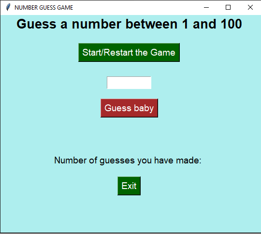

# Number Guessing Game
using the Python Tkinter module to guessing a randomly generated number.
The game is developed using the Tkinter module, which provides a graphical user interface for the game.
The game has a start/Restar button that starts the game and a text entry field where the user can enter their guess.
The game also has a display that shows how many gueeses you made. If the user fails to guess the number it give hints to the user such as “ Enter higher or lower number”. If the user enters the correct number,
a message is displayed indicating that they have won the game. The game will continues until the user wins, then the user can click on exit Button. The game is designed to be simple and user-friendly,
making it an ideal project for beginners to learn the basics of the Python Tkinter module and game development.

## Rules of Games

- there is no rules, the user have unlimited guesses to make untile wins the game.

## Steps to create a project
### Step 1.
 Install Tkinter. Tkinter provides a graphical user interface where we are going to develop a UI for users.

`pip install tk`

```
from tkinter import *
import random
```
### Step 2.
 Create a function to generate a number
 ```
def New_game():
    global num, chance
    chance = 0
    # clear the contents for entry widgets 
    guessInput.delete(0, "end")
    comment.delete(0, "end")
    chanceentry.delete(0,"end")
    guessButton.config (state= 'normal')
    num = random.randint(1,100)
```

Here We are using the randint function of Python to generate the random number between 1 and 100.

### step 3.
setup the window size, title
```
window = Tk()
window.title("NUMBER GUESS GAME")
window.geometry("540x450")
```

### step 4.
Initializing the screen by calling the constructor of Tkinter TK() and taking user input from the user 
```
textlable= Label(text="Guess a number between 1 and 100", font=("Arial",20,"bold"),
                 bg="PaleTurquoise2")
textlable.grid(row=0, column=0, sticky= 'N', padx=30)
guessInput= Entry(font=("bold", 14), width=6)
guessInput.grid(row=2, column=0 , padx=10, pady=10)
comment = Entry(font=("bold",14), bg="PaleTurquoise2", fg='black' , bd=0, width= 23)
comment.grid(row=4, column=0, padx=50 ,pady=20 )
chancelable= Label(text="Number of guesses you have made: ",font=("bold",14),bg="PaleTurquoise2" )
chancelable.grid(row=5, column=0)
chanceentry= Entry(font=("bold", 14), width=4 , textvariable=chance_var,bd=0, bg="PaleTurquoise2")
chanceentry.grid(row=5 , column=0 , sticky='e')

chanceentry.delete(0,"end")

startButton= Button(text="Start/Restart the Game",bg="dark blue", fg="white",font=("bold",14), command=New_game )
startButton.grid(row=1, column=0, padx=10, pady=20)
guessButton=Button(text="Guess baby",bg="brown", fg="white",font=("bold",14), state='disabled'
                   ,command=play_game)
guessButton.grid(row=3, column=0, padx=10, pady=10)

exitButton= Button(text="Exit",bg="dark green", fg="white",font=("bold",14), command=window.destroy )
exitButton.grid(row=6, column=0 , pady=20)
```
### Step 5.  
Declaring result function which will validate the user input and display message according to user input.
```
def play_game():
    global chance
    numGuess = int(guessInput.get())
    chance +=1
    if numGuess < num:
        comment.delete (0, "end")
        comment.insert(0,"Hint: Entre a higher number!")
    elif numGuess > num:
        comment.delete (0, "end")
        comment.insert(0, "Hint: Enter a smaller number!")
        
    else:
        comment.delete (0, "end")
        comment.insert(0, "Congratulations!! YOU WON!!")
        guessButton.config (state= 'disabled')
    chance_var.set(chance)
```
### Step 7.  
Finally initialized game using the main loop () function.
```
window.mainloop()
```

### Final Code :
```
from tkinter import *
import random

#create the window
window = Tk()
window.title("NUMBER GUESS GAME")
window.geometry("540x460")
window.configure(bg='PaleTurquoise2')
window.resizable(False, False)

chance_var = IntVar()

def New_game():
    global num, chance
    chance = 0
    # clear the contents for entry widgets 
    guessInput.delete(0, "end")
    comment.delete(0, "end")
    chanceentry.delete(0,"end")
    guessButton.config (state= 'normal')
    num = random.randint(1,100)
    
def play_game():
    global chance
    numGuess = int(guessInput.get())
    chance +=1
    if numGuess < num:
        comment.delete (0, "end")
        comment.insert(0,"Hint: Entre a higher number!")
    elif numGuess > num:
        comment.delete (0, "end")
        comment.insert(0,"Hint: Enter a smaller number!")
        
    else:
        comment.delete (0, "end")
        comment.insert(0,"Congratulations!! YOU WON!!")
        guessButton.config (state= 'disabled')
    chance_var.set(chance)
    

textlable= Label(text="Guess a number between 1 and 100", font=("Arial",20,"bold"),
                 bg="PaleTurquoise2")
textlable.grid(row=0, column=0, sticky= 'N', padx=30)
guessInput= Entry(font=("bold", 14), width=6)
guessInput.grid(row=2, column=0 , padx=10, pady=10)
comment = Entry(font=("bold",14), bg="PaleTurquoise2", fg='black' , bd=0, width= 23)
comment.grid(row=4, column=0, padx=50 ,pady=20 )
chancelable= Label(text="Number of guesses you have made: ",font=("bold",14),bg="PaleTurquoise2" )
chancelable.grid(row=5, column=0)
chanceentry= Entry(font=("bold", 14), width=4 , textvariable=chance_var,bd=0, bg="PaleTurquoise2")
chanceentry.grid(row=5 , column=0 , sticky='e')

chanceentry.delete(0,"end")

startButton= Button(text="Start/Restart the Game",bg="dark blue", fg="white",font=("bold",14), command=New_game )
startButton.grid(row=1, column=0, padx=10, pady=20)
guessButton=Button(text="Guess baby",bg="brown", fg="white",font=("bold",14), state='disabled'
                   ,command=play_game)
guessButton.grid(row=3, column=0, padx=10, pady=10)

exitButton= Button(text="Exit",bg="dark green", fg="white",font=("bold",14), command=window.destroy )
exitButton.grid(row=6, column=0 , pady=20)

window.mainloop()

```

### Output:

